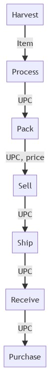
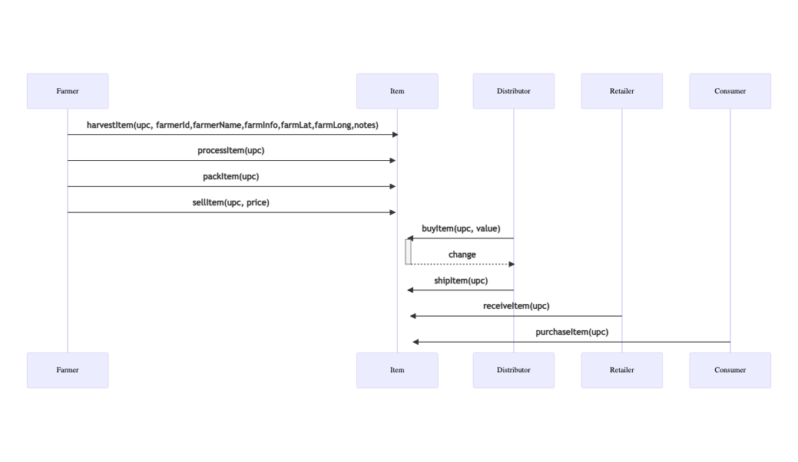
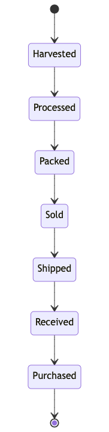
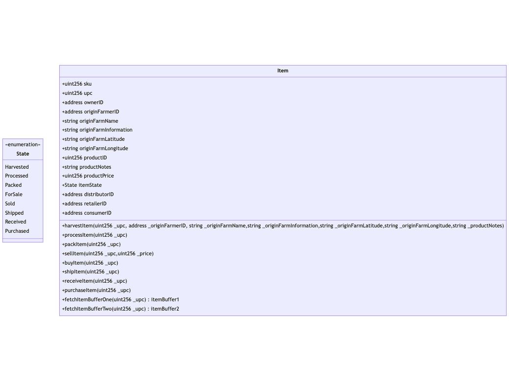

# Contract

I deployed supply chain contract on ropsten testnet because it's difficult to have enough ethers on rinkeby.

SupplyChain Contract address: 0xff97a0fc88ba867034dfbfc271f49339408e8fb5
https://ropsten.etherscan.io/address/0xff97a0fc88ba867034dfbfc271f49339408e8fb5

Contract creation transaction id:
https://ropsten.etherscan.io/tx/0x59b432042f253eef7860f984a7cdf33a57ed02e2b0a4682aee7efcbfa5c1e606

# Dependencies

- Node: v14.15.4
- Truffle: 4.1.14
- Web3: 1.7.0
- Node dependencies:
  - Web3 1.7.0 : To communicate with SupplyChain smart contract
  - webpack webpack-dev-server, webpack-cli, style-loader, css-loader, copy-webpack-plugin: To package dapp

# Diagrams

## Activity Diagram

## Sequence diagram

## State diagram

## Class diagram

